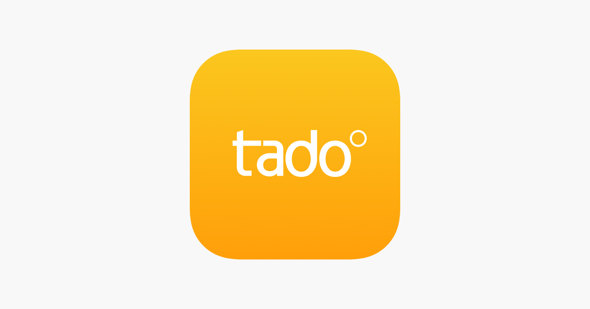

Découvrez comment piloter votre thermostat Tado avec Python et la librairie libtado.
Vous pourrez ainsi automatiser le changement de température de votre thermostat en fonction de vos besoins.
La librairie libtado est également compatible avec les interface de domotique comme Home Assistant.



<!-- truncate -->

## Introduction

> Pourquoi un thermostat connecté ?

Les thermostats connectés ont révolutionné notre manière de gérer le chauffage et la climatisation à domicile.
Grâce à eux, vous pouvez non seulement optimiser votre confort thermique, mais aussi réaliser des économies d'énergie significatives.
Avec un contrôle intelligent, il devient possible d’ajuster la température en fonction de votre emploi du temps ou de la météo.
Et cerise sur le gâteau, tout cela se fait à distance, depuis votre smartphone ou même via des scripts programmés.

Dans cet article, je vous présente **Tado**, une marque de thermostat connecté que j’utilise personnellement, et je vous montre comment la bibliothèque Python **libtado** peut vous aider à personnaliser davantage son contrôle.

## Leurs avantages

Tado est l’une des marques les plus populaires sur le marché des thermostats connectés.
Pourquoi ?
Parce qu’elle combine une interface utilisateur intuitive avec une compatibilité étendue : chaudière, radiateurs, pompes à chaleur, tout y passe.

Les fonctionnalités phares incluent :

- **Géolocalisation** : ajustement automatique en fonction de votre présence.
- **Rapports d’économie d’énergie** : pour suivre vos performances.
- **Compatibilité avec les assistants vocaux** : Alexa, Google Assistant, et Apple HomeKit.

En tant qu’utilisateur, j’ai été séduit par la facilité d’installation et les nombreuses options pour personnaliser le chauffage en fonction de mon emploi du temps.

## La concurrence est rude

Le marché des thermostats connectés est en pleine expansion, porté par l’envie de concilier confort et économies d'énergie.
Voici un aperçu des acteurs principaux, chacun ayant ses particularités :

- Nest (Google Nest) : Le pionnier des thermostats intelligents. Nest est reconnu pour son design élégant, son apprentissage automatique qui ajuste la température selon vos habitudes, et son intégration transparente avec l’écosystème Google.
- Netatmo : Une solution française qui mise sur la simplicité et l’efficacité énergétique. Compatible avec Apple HomeKit et Alexa, Netatmo propose des rapports d’économie d’énergie clairs et une géolocalisation performante.
- Sowee : Développé par EDF, ce thermostat est pensé pour les foyers français. Il se distingue par son interface moderne et ses fonctions avancées liées à la consommation d’énergie, particulièrement adaptées à ceux qui cherchent à maîtriser leurs factures.
- Somfy : Une marque réputée dans la domotique qui propose des thermostats connectés compatibles avec ses volets roulants, stores, et autres produits. Idéal pour une intégration domotique complète.

Chaque solution a ses forces, mais dans cet article, je vais vous parler en détail de Tado, une option qui combine simplicité, flexibilité et performance.

## Le contrôle à distance avec Python

Si les applications mobiles Tado offrent déjà un contrôle puissant, les développeurs et bricoleurs comme moi aiment souvent aller plus loin
C’est ici que **libtado**, une bibliothèque Python non officielle, entre en jeu.

Avec **libtado**, vous pouvez piloter votre thermostat depuis des scripts Python
Cela ouvre la porte à des automatisations sur mesure :

- Ajuster la température selon des seuils prédéfinis.
- Créer des scénarios avancés en fonction des prévisions météo.
- Intégrer Tado à des systèmes domotiques personnalisés.

Pour commencer avec libtado, il vous suffit de l’installer via pip et d’avoir vos identifiants Tado à portée de main.

## Utilisation de libtado

### Installation de libtado

Commencez par installer la bibliothèque avec la commande suivante :

```bash
pip install libtado
```

### Configuration initiale

Créez un script Python de base pour vous connecter à votre thermostat
Voici un exemple :

```python
from libtado import Tado

# Authentification avec vos identifiants Tado
TADO_USERNAME = "votre_email"
TADO_PASSWORD = "votre_mot_de_passe"
TADO_CLIENT_SECRET = "wZaRN7rpjn3FoNyF5IFuxg9uMzYJcvOoQ8QWiIqS3hfk6gLhVlG57j5YNoZL2Rtc"

tado = Tado(TADO_USERNAME, TADO_PASSWORD, TADO_CLIENT_SECRET)

# Récupération des informations de température actuelles
zones = tado.get_zones()
for zone in zones:
    state = tado.getState(zone['id'])
    print(f"Zone {zone['name']} : {state['sensorDataPoints']['insideTemperature']['celsius']}°C")
```

### Contrôle de la température

Vous pouvez également modifier la température d’une zone avec une simple commande :

```python
tado.set_temperature(1, 22.5, 3600)
# 22.5°C pendant 1 heure en zone 1
```

## Une maison connectée accessible

Un thermostat connecté comme celui de Tado améliore non seulement votre confort, mais réduit également vos factures énergétiques
En y ajoutant la flexibilité de Python grâce à libtado, vous gagnez un contrôle total et des possibilités quasi infinies pour automatiser votre maison.

Si vous êtes un amateur de technologie, libtado est une excellente manière de mettre les mains dans le cambouis tout en rendant votre maison plus intelligente
Alors, pourquoi ne pas essayer dès aujourd’hui ?

## Liens utiles

- [Site officiel de Tado](https://www.tado.com/)
- [Documentation de libtado](https://libtado.readthedocs.io/)
- [GitHub de libtado](https://github.com/germainlefebvre4/libtado)
